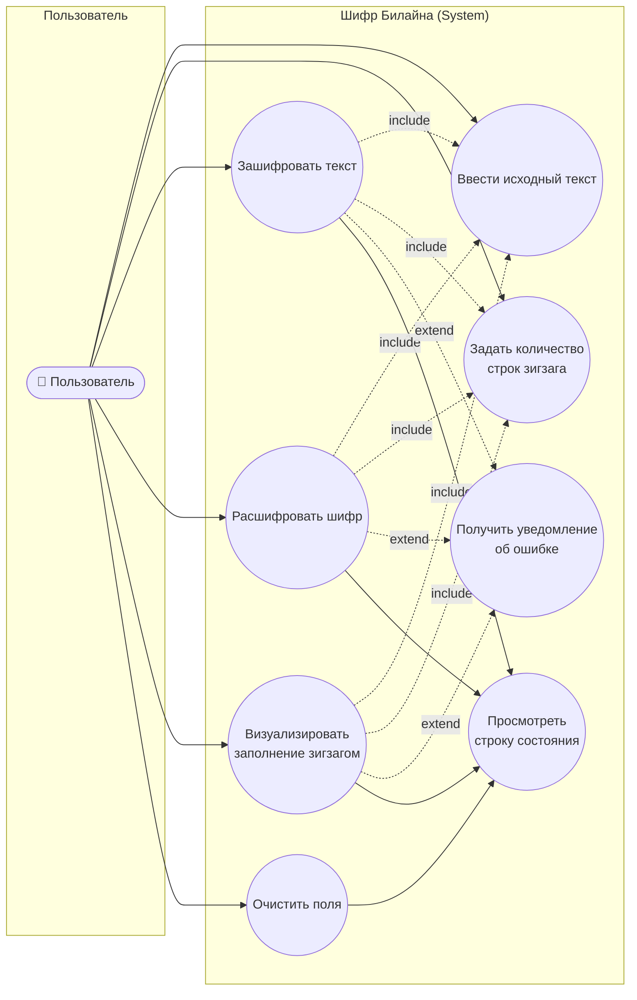
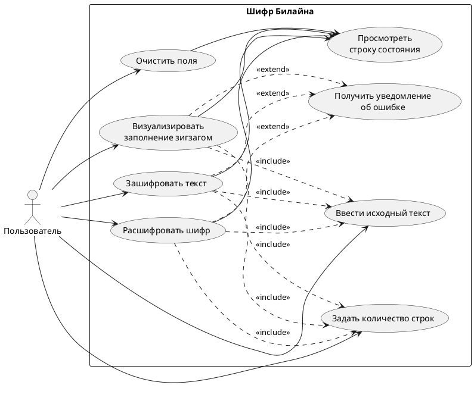

# Диаграмма вариантов использования (Use Case)

Диаграмма вариантов использования для приложения «Шифр Билайна» (вариант 13). Описывает функциональные взаимодействия между актором (пользователем) и системой.

## Mermaid (рендерится автоматически на GitHub)

## PlantUML

## Описание вариантов использования

### UC1. Ввести исходный текст

| Поле | Значение |
| --- | --- |
| Актор | Пользователь |
| Цель | Загрузить открытый текст или шифр в систему для последующей обработки |
| Предусловие | Приложение запущено, главное окно открыто |
| Основной сценарий | 1. Пользователь устанавливает фокус на поле «Исходный текст». 2. Вводит текст с клавиатуры или вставляет из буфера обмена (Ctrl+V). |
| Постусловие | Поле `txtInput` содержит введённый текст |
| Альтернативный | Если в полях результата есть устаревший данные — они автоматически сбрасываются (BUG-007 fix) |

### UC2. Задать количество строк

| Поле | Значение |
| --- | --- |
| Актор | Пользователь |
| Цель | Указать число рельсов зигзага (от 2 до 100) |
| Основной сценарий | 1. Пользователь использует стрелки `NumericUpDown` или вводит значение напрямую. 2. Система ограничивает значение диапазоном [2, 100]. |
| Постусловие | `numRows.Value ∈ [2, 100]` |

### UC3. Зашифровать текст

| Поле | Значение |
| --- | --- |
| Актор | Пользователь |
| Цель | Получить шифр заданного текста с заданным числом строк |
| Включает | UC1, UC2 |
| Расширяется | UC7 (при ошибке валидации) |
| Триггеры | Нажатие кнопки «Зашифровать» или горячая клавиша `Ctrl+Enter` (BUG-005 fix) |
| Основной сценарий | 1. Триггер сработал. 2. Система валидирует ввод (не null, не пустой, не пробельный). 3. Передаёт данные в `BeelineCipherCore.Encrypt(text, rows)`. 4. Записывает результат в `txtOutput`. 5. Строит визуализацию через `Visualize`. 6. Обновляет StatusStrip. |
| Альтернатива | Если `rows ≥ длине текста` — StatusStrip сообщает о тривиальном шифровании (BUG-006 fix) |

### UC4. Расшифровать шифр

| Поле | Значение |
| --- | --- |
| Актор | Пользователь |
| Цель | Восстановить исходный текст из шифра |
| Включает | UC1, UC2 |
| Расширяется | UC7 |
| Триггер | Нажатие кнопки «Расшифровать» |
| Основной сценарий | Аналогичен UC3, но используется `BeelineCipherCore.Decrypt(cipher, rows)` |

### UC5. Визуализировать заполнение зигзагом

| Поле | Значение |
| --- | --- |
| Актор | Пользователь |
| Цель | Увидеть, как текст распределяется по рельсам зигзага |
| Триггер | Нажатие кнопки «Показать зигзаг» |
| Основной сценарий | 1. Валидация. 2. Вызов `BeelineCipherCore.Visualize(text, rows)`. 3. Запись результата в `txtVisualization` (моноширинный шрифт Consolas 11pt). |

### UC6. Очистить поля

| Поле | Значение |
| --- | --- |
| Актор | Пользователь |
| Цель | Сбросить состояние формы |
| Триггер | Нажатие кнопки «Очистить» |
| Основной сценарий | 1. `txtInput`, `txtOutput`, `txtVisualization` очищаются. 2. `numRows` устанавливается в значение 3 по умолчанию. 3. Фокус возвращается в поле ввода. 4. StatusStrip: «Поля очищены». |

### UC7. Получить уведомление об ошибке

| Поле | Значение |
| --- | --- |
| Актор | Пользователь |
| Тип | Расширение UC3, UC4, UC5 |
| Триггер | Невалидный ввод (null, пустая строка, только пробелы, rows вне [2,100]) |
| Основной сценарий | 1. Появляется `MessageBox` с иконкой `Warning` и текстом ошибки на русском. 2. StatusStrip обновляется на «Операция прервана из-за ошибки.». 3. Фокус переводится на поле, вызвавшее ошибку. |

### UC8. Просмотреть строку состояния

| Поле | Значение |
| --- | --- |
| Актор | Пользователь |
| Цель | Увидеть результат последней операции и метаданные |
| Триггер | Любая операция (UC3..UC6) |
| Постусловие | StatusStrip содержит сообщение вида «Зашифровано. Длина: N символов, строк: M.» |
